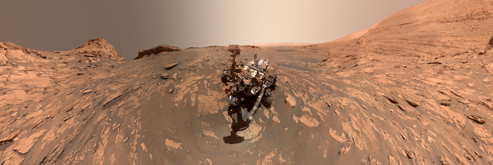

# Mars Spectrometry 2: Gas Chromatography (GCMS)  



*Image courtesy of
[NASA/JPL-Caltech/MSSS.](https://mars.nasa.gov/resources/26384/two-versions-of-a-curiosity-selfie-narrow-and-wide/)*

## General
* **Problem statement:** Did Mars ever have environmental conditions that could have supported life?  
* **Type:** Multi-Label Classification
* **Host:** NASA
* **Platform:** Drivendata
* **Competition link:** https://www.drivendata.org/competitions/97/nasa-mars-gcms/
* **Placement:** 3rd (3/537)  
* **User Name:** Ouranos  
* **System used:** Google Colab Pro  
* **Solution:** [write-up](./write_up_Ouranos.pdf)  
* **Data preparation duration:** Less than 1.5 hours (can be optimized)  
* **Train duration:** Less than 2 hours  
* **Inference duration:** 40 min data preparation, 15 min inference in CPU (less in
GPU) (for both valid and test data)  

<br />  

The solution is based on the ensemble of CNN over 2d representations (m/z over time) and simple NN, logistic regression and ridge classification models over statistical features of 2d representations of the mass spectrometry intensity. Data augmentation is applied only at CNN models within model layers, during training. Averaging the results of the different architecture models, trained on differently preprocessed data.  

<br />  

### Requirements  
Linux system, python 3, virtualenv, NVidia GPU should be fine.  
All my trainings took place in Google Colab Pro using a Tesla T4 GPU. 
requirements.txt is the ```!pip3 freeze``` output, truly necessary libraries are in requirements2.txt (untested)  

Install dependencies, using python 3.8 with virtualenv  
```shell
pip install -r requirementx.txt
```

### Data preparation  

The training data are extracted to the RAW_DATA_PATH directory, as it is configured in config_paths.py  

RAW_DATA_PATH  
├── val_labels.csv  
├── metadata.csv  
├── train_labels.csv  
├── submission_format.csv  
├── val_features/val_features/\*.csv  
├── train_features/train_features/\*.csv  
├── test_features/\*.csv  


### Configuration  
Modify the mars_spectrometry_2/config_paths.py to specify the paths.  


### Trained models  
Extract trained models zip files and set models directory path to config_paths.py file (not available)  


### Make datasets  
After setting raw data to correct place and configuring the paths, parse through
all train and test files and create 3 [train, test] sets of datasets. Depending 
on the system, this will take less than 1.5 hours.

```shell
cd mars_spectrometry_2
python make_datasets.py
```


Generated files at processed_data_path:  
* DS1_train.npz  
* DS1_test.npz  
* DS1s1_train.npz  
* DS1s1_test.npz  
* DS2_train.npz  
* DS2_test.npz  


### Generate submission  
Run prediction using the supplied trained model weights from model_path. Because
of light models used, inference can take place in CPU at less than 15 minutes.  

```shell
python run_inference.py  
```

Submission is generated in working directory.  
submission file name L1_KKcnnLrRc_v18.csv.   


### Re-train models

Run all models sequentially. This will save models in model_path directory and 
overwrite existing models. All models will be trained in less than 2 hours using
a Tesla T4 GPU.  

```shell
python run_training.py  
```


### Notebook  
Instead of using python scripts for training, use the train and infer notebook  
All raw and processed files are required to run the notebook. To get the processed file run make_datasets.py script first.  
Four submission files are produced with this notebook. Simple average these files to acquire final submission.  
[train and infer notebook](./Mars2_Final_train_and_predict.ipynb)   


